# CNN-based Face Alignment

I use mxnet(http://mxnet.io/) to predict 68 facial feature points which is used in 300W (http://ibug.doc.ic.ac.uk/resources/300-W/).


## Train
1. I assume that mxnet is installed.
2. You need to download training (LFPW, AFW, HELEN, and IBUG) and test images from 300W , and they are stored in 'original_images' directory.
3. You need to prepare record for mxnet.
3-1. To generate normalized images from training images, execute following command:
```
$ cd prepare_data
$ python collect_augmented_images.py
```
Then, training_data.lst and test_data.lst are created.

3-2. To create record file, you execute 'im2rec' command in mxnet.
Before execute following commands, place 'im2rec' file exactly in 'prepare_data/im2rec.sh'
```
$ cd prepare_data
@ sh im2rec.sh
```
Then, training_data.rec, test_data.rec are created.

4. You can train CNN for facial feature point estimation.
```
$ cd ../mxnet
$ sh train_net.sh
```
You can see several parameters in train_net.sh.

In this repository, I added two networks : vgg16 (mxnet/symbols/vgg_16_reduced.py) and inception with batch normalization (mxnet/symbols/inception_bn.py)

5. After training, you can see learning curves.
```
$ python draw_result.py
```
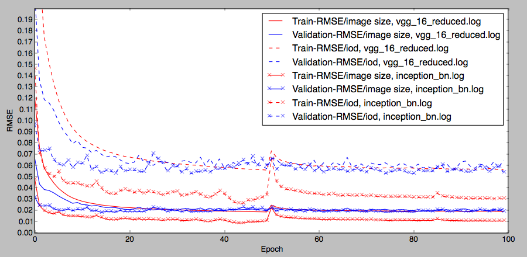


## Test
I assume that you trained vgg16 so that the related files(vgg_16_reduced-0050.params, vgg_16_reduced-symbol.json) are located in 'mxnet'.

Using opencv's face detector, cropped face is given to predict facial feature points.
```
$ python predict.py
```

These are some examples.
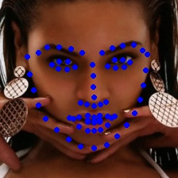
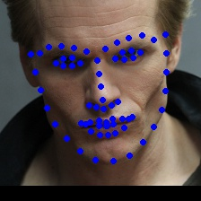
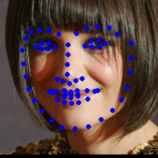
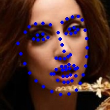
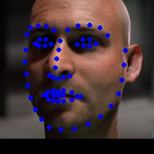
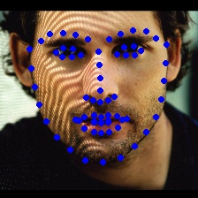
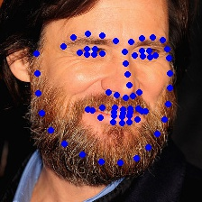
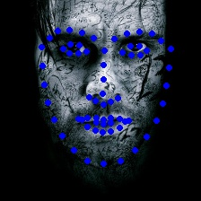
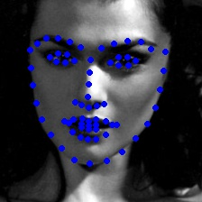
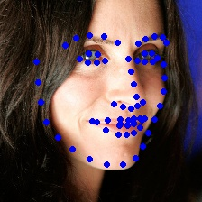
